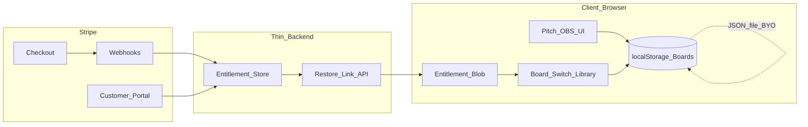

# ZoneBoard — Stripe / Pro アーキテクチャ（正本）

**更新:** 2026-10-08  
**ステータス:** セカンドオピニオン反映 · **CONDITIONAL ADOPT** · 実装未着手  
**親決定:** [`PRODUCT_NOTE.md`](PRODUCT_NOTE.md) — Pro = Local Library Entitlement（2026-08-27）  
**足場コード:** [`src/lib/plan.ts`](../src/lib/plan.ts)  
**Backlog:** B-023（課金・Pro ゲート）

---

## 0. 一言

> Stripe-first だが SaaS-first ではない。  
> Pro は「クラウドの机」ではなく **端末の引き出し（Local Library）＋ BYO の封筒（Portability）**。  
> Board / Scene / 座標はサーバに置かない。User Account は作らない。

**Executive Judgment:** CONDITIONAL ADOPT  
棄却する案: **Pro = Board Portability のみ** / **Free で Board JSON Export 不可** / **月額 Subscription を価格本線とする**。

---

## 1. 2026-08-27 決定との差分（棄却した案）

| 項目 | 棄却案（Stripe 検討ドラフト） | 正本（本ドキュメント） |
|------|------------------------------|-------------------------|
| Pro の核 | Board Portability（Export/Import）だけ | **Local Library**（上限緩和 · 選手セット · 画角テンプレ）＋ BYO Portability は手段 |
| Free の Board JSON Export | 不可（Pro のみ） | **無料（逃げ道・楔）** |
| Free の Board JSON Import | 不可 | **単発取込は無料可**。上限超過・複数セット保有は Pro |
| Board Library UI | Free/Pro 共通（ロック付き Export） | **共通は正しい**。ただし Export 全体ロックはしない |
| 価格本線 | 月額 Subscription | **年額 or 一回買いを本線**。月額は補助。Stripe は決済管として使う |
| Identity | Accountless Restore（詳細未定） | **Purchase Identity**（Checkout email + signed license）。Login と呼ばない |

**棄却理由（要約）:**  
Free で Export を閉じると、localStorage 消失時にデータが人質になる。それは local-first / privacy-first の信頼契約を壊し、Recovery の Primary Action（Export）とも自己矛盾する。Portability 単体は月額継続価値が弱い。

---

## 2. Free / Pro マトリクス（改訂）

機能を水増ししない。既存決定の再掲＋課金境界の明確化。

| | **Free** | **Pro** |
|--|----------|---------|
| コア（描画 · Broadcast · ロゴ · ズーム） | ○（楔。削らない） | 同じ |
| PNG Export | ○ | 同じ |
| 試合 Board / Scene 上限 | 3 / 8 | 緩和（`PLAN_LIMITS.pro`） |
| Board 切替 UI（Board Library） | ○（標準 UI） | 同じ |
| **Board JSON Export（バックアップ逃げ道）** | **○ 必須** | 同じ |
| Board JSON Import（単発・1 Board 取込／置換） | ○ | 同じ |
| 名前付き選手セット（横断） | —（今夜の名簿のみ） | ○ |
| 名前付き画角テンプレ（横断） | — | ○ |
| Import で Library 資産を複数保有・上限超過まで運ぶ | — | ○ |
| Pitch / Broadcast 上の課金 UI | 出さない | 出さない |

**一文の売り:**

> Pro = 端末上の Local Library（引き出し）＋ BYO Portability（封筒）

Portability は核の説明ではなく、核を運ぶ手段。

### 2-1. Board Library vs Preset Library

混同しない。

| 面 | 役割 | Free/Pro |
|----|------|----------|
| **Board Library**（Board 切替） | 最大 N 枚の机を切り替える。プレビュー・Scene 数・改名・削除 | **共通**。第二ホーム／ダッシュボードにしない |
| **Preset Library**（引き出し） | Squad Presets · Matchday Viewports | **中身の複数保有が Pro**。入口の一覧 UI 自体は Prep 内 |

`/library` を第一画面にしない。起動は最後の Board／ワンクリックでピッチ。

### 2-2. 解約・失効後

- Board データは **消さない**（localStorage に残す）
- Free 上限を超えて既にある Board は **読み取り・編集可**。新規作成のみ上限適用
- Preset Library の複数セットは閲覧は維持しつつ、新規保存・追加 Import は Pro 再契約までロック（実装時に `plan.ts` entitlements で固定）
- Board JSON Export は失効後も **無料のまま**（逃げ道を課金に依存させない）

---

## 3. Purchase Identity（Account ではない）

User Account / Google Login / パスワードは作らない。  
必要なのは **Merchant-of-Record 上の購入者識別**だけ。

```text
Stripe Customer (email at Checkout)
  → entitlement record (customer_id, status, period_end)
  → device grant (signed entitlement blob in localStorage)
  → Restore Pro: email magic link（短命）または Customer Portal
```

| レイヤ | やる | やらない |
|--------|------|----------|
| Checkout | Stripe Checkout · email 収集 | 自前サインアップ |
| Backend | webhook → entitlement のみ | Board / Scene / 座標の保存 |
| Device | signed license blob | 平文 email だけで誰でも Restore |
| Restore UI | 「Restore Pro with purchase email」 | 「Login」「Sign in with Google」 |
| Billing UI | Stripe Customer Portal | 自前 Billing ダッシュボード・マイページ |
| Diagnostic | browser / OS / version / counts / error class | Board 中身・駒座標・戦術データ |

**同時端末:** ポリシーを文案で明示（例: 同時 2 device grant）。厳しい DRM にしない。共有 PC は「このブラウザに復元」と書く。

**Abuse 防止の最低線:** Restore link は短命・単回。Checkout success URL  alone を永久鍵にしない。

---

## 4. システム関係（最小構成）



| 部品 | 責任 |
|------|------|
| **Client** | 既存 Pitch。課金 UI は Library / Settings のみ |
| **Local data** | Boards / Scenes の正本。サーバに送らない |
| **Stripe** | Checkout · Portal · Webhooks |
| **Backend** | entitlement 行のみ（小さくてよい） |
| **Entitlement** | signed local license。Restore は purchase email |
| **Board Library** | Free/Pro 共通の切替面 |
| **Recovery** | Error Page ではなく Recovery State（次節） |

薄い entitlement サーバの横に「ついでに Board backup」を足したら境界違反。

---

## 5. Recovery / Export 一貫性（固定）

**原則:** Error Page を量産しない。Recovery State にする。

各 Recovery は最低限:

1. What happened?
2. Is my data safe?
3. What should I do now?
4. Primary action
5. Fallback / escalation

内部用語（localStorage · QuotaExceededError · webhook · schema · Blob）をユーザに見せない。

### 5-1. 固定契約（矛盾禁止）

> **Storage full（および local 消失系）の Primary Action は Board JSON Export である。**  
> したがって Board JSON Export を Pro ゲートにしてはならない。

| Recovery | Primary（例） | 備考 |
|----------|---------------|------|
| Storage full | Export this Board as JSON | Free 必須 |
| Checkout 成功だがまだ Free | Confirming purchase… Retry / Restore by email | pending + webhook 遅延 |
| Payment failure | Update payment（Portal） | grace period。Broadcast 中は通知のみ |
| Pro expired | Boards remain. Limits apply to new items | データ削除しない |
| Import failed | Keep current Board. Fix file / try again | 検証失敗で既存を触らない |
| Private mode | Saving unavailable in this window | 起動時に明示 |
| localStorage wiped | Restore Pro by email + re-import JSON backup | Export が Free だから再起できる |

Problem Report（任意）: Browser · OS · ZoneBoard version · Board/Scene count · last action · error class · timestamp · diagnostic ID。**Board 中身は送らない。**

空の AI Chatbot をサポート起点にしない。将来やるなら Recovery State に Context を載せる形のみ。

---

## 6. UX / HCI ガードレール

1. Broadcast Mode に FREE/PRO · Upgrade を出さない（配信面に課金を載せない — 広告決定と同型）
2. Board カードの PRIMARY はプレビューと Scene 構造。課金バッジは小さく
3. Restore Pro は Settings 奥 or Library フッタ。トップバー常設にしない
4. 起動直後に Library フルスクリーンダッシュボードにしない
5. Pitch / Scene editing / OBS 導線は Stripe 導入後も原則そのまま

---

## 7. Edge cases（実装チェックリスト）

| Case | Design | Risk | Recommendation | Priority |
| ---- | ------ | ---- | -------------- | -------- |
| Checkout 成功 | success_url | Webhook 前は Free | pending + poll / Restore | P0 |
| Webhook 遅延 | entitlement pending | 課金済なのにロック | Refresh · メール Restore | P0 |
| Payment failure | Portal | 突然ロック | grace · Broadcast 中は通知のみ | P0 |
| Cancellation | period_end まで Pro | 曖昧 | 「いつまで Pro か」明示 | P1 |
| Expiration | Board 残存 | 上限超過 Board | 編集可・新規のみ制限 | P0 |
| Restore Pro | magic link | abuse / 発見性 | 短命 link · Settings に入口 | P0 |
| Profile / PC 変更 | Restore | 見つからない | Library/Settings 固定 | P1 |
| localStorage 削除 | Board+license 消失 | 人質化 | Free Export + Restore | P0 |
| Import failure | validate first | 全消し | 既存 Board を触れない | P0 |
| Export failure | Recovery | 用語露出 | キャンセル / 容量不足に分岐 | P1 |
| Storage full | Export primary | — | Free Export 必須 | P0 |
| Private mode | 起動 Recovery | 毎回復元不能感 | 保存不可を明示 | P0 |
| 複数タブ | 競合 | 上書き・二重 Checkout | 単一 writer or トースト | P1 |
| 古い / 壊れた JSON | migrate / reject | 破損 | parse gate · 既存保護 | P0–P1 |
| Email 紛失 | Portal | Pro 喪失 | Portal email 更新 + サポート | P1 |

---

## 8. What NOT to Build

- User Account / Google Login / パスワード
- Board / Scene / 座標のクラウド保存・同期
- SaaS Workspace / チーム / 権限
- `/library` 第一ホーム化
- 自前 Billing ダッシュボード
- Free からの Board JSON Export 全面禁止
- Pitch / Broadcast 上の常時 Upgrade バナー
- 空の AI Chatbot サポート起点
- Pro のための機能水増し（Drill template · 季節ロスター · 分析）
- 月額を「一般的な SaaS だから」本線固定
- diagnostic への戦術データ混入
- entitlement サーバ横の自前 Board backup

---

## 9. 実装順序（B-023 向けメモ）

コードはまだ書かない。着手時の順:

1. Free Board JSON Export/Import（楔・Recovery）— 課金より先でも可
2. Stripe Checkout + webhook → entitlement store
3. signed device license + Restore by email
4. Customer Portal リンク
5. Pro entitlements を `plan.ts` の `activePlan()` に接続（DEV override は維持）
6. Preset Library CRUD（B-020 系）を entitlement でゲート
7. Recovery States（Storage full · pending · expired）

---

## 10. ZoneBoard のままか？

**条件付き Yes** — 本ドキュメントの制約を守る限り。

棄却案（Export 有料 · Pro=Portability のみ · 月額本線）のまま進めると **No**（データの逃げ道が課金ゲートになり、local-first が人質契約になる）。
