# Canvas text — glyph render check (locale × font)

**Date:** 2026-08-31
**URL:** http://localhost:5173/board?lang=…
**Runner:** Puppeteer · pixel ink audit + canvas clip screenshot

Detects missing glyphs when a font stack cannot render a character (Canvas does not use CSS `unicode-range` fallback per glyph). Reference: `Noto Sans JP` + `Noto Sans`.

## Conclusion

**字形欠けなし（36/36 PASS）。** 9 ロケール × `system` / `display` ×（各ロケール文字列 + 混在 `Müller · 天皇杯 · Łódź · İstanbul`）を Canvas 上に描画し、ピクセルインク監査 + クリップ PNG で確認。

再実行: `npm run dev` 起動中に `npm run test:canvas-glyph-locale`

## Summary

| Locale | Font | Sample | Pass | Missing glyphs | Screenshot |
| --- | --- | --- | --- | --- | --- |
| en | system | locale | ✅ | — | [en-system-locale.png](canvas-glyphs/en-system-locale.png) |
| en | system | mixed | ✅ | — | [en-system-mixed.png](canvas-glyphs/en-system-mixed.png) |
| en | display | locale | ✅ | — | [en-display-locale.png](canvas-glyphs/en-display-locale.png) |
| en | display | mixed | ✅ | — | [en-display-mixed.png](canvas-glyphs/en-display-mixed.png) |
| ja | system | locale | ✅ | — | [ja-system-locale.png](canvas-glyphs/ja-system-locale.png) |
| ja | system | mixed | ✅ | — | [ja-system-mixed.png](canvas-glyphs/ja-system-mixed.png) |
| ja | display | locale | ✅ | — | [ja-display-locale.png](canvas-glyphs/ja-display-locale.png) |
| ja | display | mixed | ✅ | — | [ja-display-mixed.png](canvas-glyphs/ja-display-mixed.png) |
| es | system | locale | ✅ | — | [es-system-locale.png](canvas-glyphs/es-system-locale.png) |
| es | system | mixed | ✅ | — | [es-system-mixed.png](canvas-glyphs/es-system-mixed.png) |
| es | display | locale | ✅ | — | [es-display-locale.png](canvas-glyphs/es-display-locale.png) |
| es | display | mixed | ✅ | — | [es-display-mixed.png](canvas-glyphs/es-display-mixed.png) |
| pt | system | locale | ✅ | — | [pt-system-locale.png](canvas-glyphs/pt-system-locale.png) |
| pt | system | mixed | ✅ | — | [pt-system-mixed.png](canvas-glyphs/pt-system-mixed.png) |
| pt | display | locale | ✅ | — | [pt-display-locale.png](canvas-glyphs/pt-display-locale.png) |
| pt | display | mixed | ✅ | — | [pt-display-mixed.png](canvas-glyphs/pt-display-mixed.png) |
| pl | system | locale | ✅ | — | [pl-system-locale.png](canvas-glyphs/pl-system-locale.png) |
| pl | system | mixed | ✅ | — | [pl-system-mixed.png](canvas-glyphs/pl-system-mixed.png) |
| pl | display | locale | ✅ | — | [pl-display-locale.png](canvas-glyphs/pl-display-locale.png) |
| pl | display | mixed | ✅ | — | [pl-display-mixed.png](canvas-glyphs/pl-display-mixed.png) |
| de | system | locale | ✅ | — | [de-system-locale.png](canvas-glyphs/de-system-locale.png) |
| de | system | mixed | ✅ | — | [de-system-mixed.png](canvas-glyphs/de-system-mixed.png) |
| de | display | locale | ✅ | — | [de-display-locale.png](canvas-glyphs/de-display-locale.png) |
| de | display | mixed | ✅ | — | [de-display-mixed.png](canvas-glyphs/de-display-mixed.png) |
| fr | system | locale | ✅ | — | [fr-system-locale.png](canvas-glyphs/fr-system-locale.png) |
| fr | system | mixed | ✅ | — | [fr-system-mixed.png](canvas-glyphs/fr-system-mixed.png) |
| fr | display | locale | ✅ | — | [fr-display-locale.png](canvas-glyphs/fr-display-locale.png) |
| fr | display | mixed | ✅ | — | [fr-display-mixed.png](canvas-glyphs/fr-display-mixed.png) |
| tr | system | locale | ✅ | — | [tr-system-locale.png](canvas-glyphs/tr-system-locale.png) |
| tr | system | mixed | ✅ | — | [tr-system-mixed.png](canvas-glyphs/tr-system-mixed.png) |
| tr | display | locale | ✅ | — | [tr-display-locale.png](canvas-glyphs/tr-display-locale.png) |
| tr | display | mixed | ✅ | — | [tr-display-mixed.png](canvas-glyphs/tr-display-mixed.png) |
| it | system | locale | ✅ | — | [it-system-locale.png](canvas-glyphs/it-system-locale.png) |
| it | system | mixed | ✅ | — | [it-system-mixed.png](canvas-glyphs/it-system-mixed.png) |
| it | display | locale | ✅ | — | [it-display-locale.png](canvas-glyphs/it-display-locale.png) |
| it | display | mixed | ✅ | — | [it-display-mixed.png](canvas-glyphs/it-display-mixed.png) |

**Locale samples:** 18/18 PASS
**Mixed script:** 18/18 PASS
**Overall:** PASS

## Failures

_None._

## Detail

### en-system-locale

- **Sample:** `High press · Müller 09`
- **Font preset:** system
- **Glyph audit:** pass
- **Screenshot:** 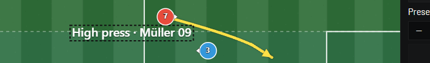

### en-system-mixed

- **Sample:** `Müller · 天皇杯 · Łódź · İstanbul`
- **Font preset:** system
- **Glyph audit:** pass
- **Screenshot:** 

### en-display-locale

- **Sample:** `High press · Müller 09`
- **Font preset:** display
- **Glyph audit:** pass
- **Screenshot:** 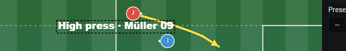

### en-display-mixed

- **Sample:** `Müller · 天皇杯 · Łódź · İstanbul`
- **Font preset:** display
- **Glyph audit:** pass
- **Screenshot:** 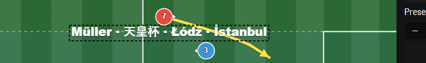

### ja-system-locale

- **Sample:** `ハイプレス · 天皇杯 · 漢字仮名`
- **Font preset:** system
- **Glyph audit:** pass
- **Screenshot:** 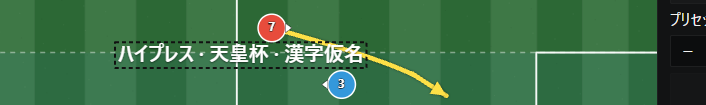

### ja-system-mixed

- **Sample:** `Müller · 天皇杯 · Łódź · İstanbul`
- **Font preset:** system
- **Glyph audit:** pass
- **Screenshot:** 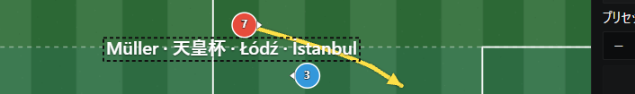

### ja-display-locale

- **Sample:** `ハイプレス · 天皇杯 · 漢字仮名`
- **Font preset:** display
- **Glyph audit:** pass
- **Screenshot:** 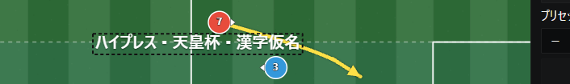

### ja-display-mixed

- **Sample:** `Müller · 天皇杯 · Łódź · İstanbul`
- **Font preset:** display
- **Glyph audit:** pass
- **Screenshot:** 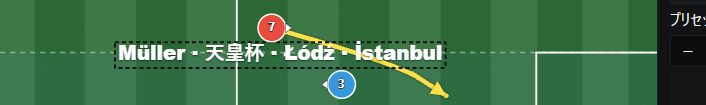

### es-system-locale

- **Sample:** `Presión alta · Niño · campeón`
- **Font preset:** system
- **Glyph audit:** pass
- **Screenshot:** 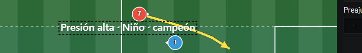

### es-system-mixed

- **Sample:** `Müller · 天皇杯 · Łódź · İstanbul`
- **Font preset:** system
- **Glyph audit:** pass
- **Screenshot:** 

### es-display-locale

- **Sample:** `Presión alta · Niño · campeón`
- **Font preset:** display
- **Glyph audit:** pass
- **Screenshot:** 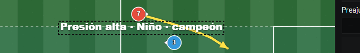

### es-display-mixed

- **Sample:** `Müller · 天皇杯 · Łódź · İstanbul`
- **Font preset:** display
- **Glyph audit:** pass
- **Screenshot:** 

### pt-system-locale

- **Sample:** `Pressão alta · São Paulo · coração`
- **Font preset:** system
- **Glyph audit:** pass
- **Screenshot:** 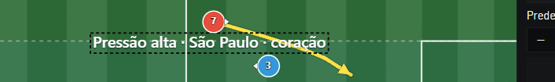

### pt-system-mixed

- **Sample:** `Müller · 天皇杯 · Łódź · İstanbul`
- **Font preset:** system
- **Glyph audit:** pass
- **Screenshot:** 

### pt-display-locale

- **Sample:** `Pressão alta · São Paulo · coração`
- **Font preset:** display
- **Glyph audit:** pass
- **Screenshot:** 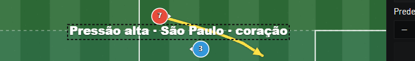

### pt-display-mixed

- **Sample:** `Müller · 天皇杯 · Łódź · İstanbul`
- **Font preset:** display
- **Glyph audit:** pass
- **Screenshot:** 

### pl-system-locale

- **Sample:** `Wysoki pressing · Łódź · ąęćłńóśźż`
- **Font preset:** system
- **Glyph audit:** pass
- **Screenshot:** 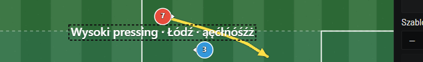

### pl-system-mixed

- **Sample:** `Müller · 天皇杯 · Łódź · İstanbul`
- **Font preset:** system
- **Glyph audit:** pass
- **Screenshot:** 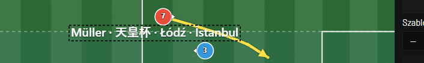

### pl-display-locale

- **Sample:** `Wysoki pressing · Łódź · ąęćłńóśźż`
- **Font preset:** display
- **Glyph audit:** pass
- **Screenshot:** 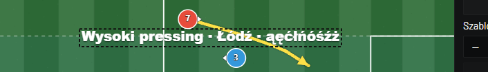

### pl-display-mixed

- **Sample:** `Müller · 天皇杯 · Łódź · İstanbul`
- **Font preset:** display
- **Glyph audit:** pass
- **Screenshot:** 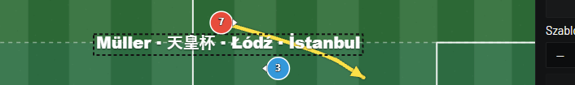

### de-system-locale

- **Sample:** `Hohes Pressing · Auswärts · Straße`
- **Font preset:** system
- **Glyph audit:** pass
- **Screenshot:** 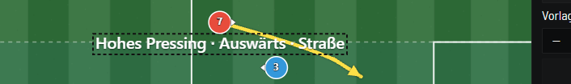

### de-system-mixed

- **Sample:** `Müller · 天皇杯 · Łódź · İstanbul`
- **Font preset:** system
- **Glyph audit:** pass
- **Screenshot:** 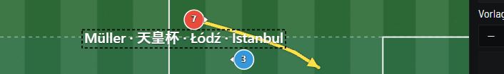

### de-display-locale

- **Sample:** `Hohes Pressing · Auswärts · Straße`
- **Font preset:** display
- **Glyph audit:** pass
- **Screenshot:** 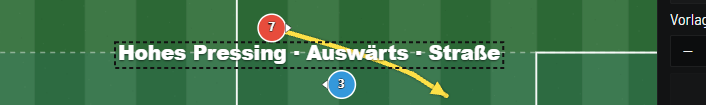

### de-display-mixed

- **Sample:** `Müller · 天皇杯 · Łódź · İstanbul`
- **Font preset:** display
- **Glyph audit:** pass
- **Screenshot:** 

### fr-system-locale

- **Sample:** `Bloc haut · équipe · François ç`
- **Font preset:** system
- **Glyph audit:** pass
- **Screenshot:** 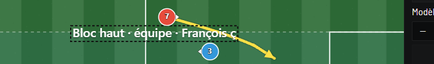

### fr-system-mixed

- **Sample:** `Müller · 天皇杯 · Łódź · İstanbul`
- **Font preset:** system
- **Glyph audit:** pass
- **Screenshot:** 

### fr-display-locale

- **Sample:** `Bloc haut · équipe · François ç`
- **Font preset:** display
- **Glyph audit:** pass
- **Screenshot:** 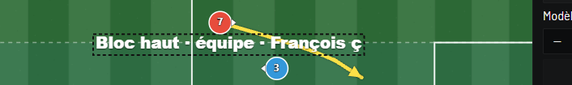

### fr-display-mixed

- **Sample:** `Müller · 天皇杯 · Łódź · İstanbul`
- **Font preset:** display
- **Glyph audit:** pass
- **Screenshot:** 

### tr-system-locale

- **Sample:** `Ön alan baskısı · İstanbul · şüphe`
- **Font preset:** system
- **Glyph audit:** pass
- **Screenshot:** 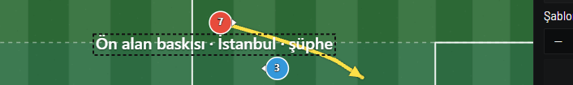

### tr-system-mixed

- **Sample:** `Müller · 天皇杯 · Łódź · İstanbul`
- **Font preset:** system
- **Glyph audit:** pass
- **Screenshot:** 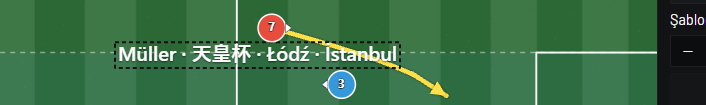

### tr-display-locale

- **Sample:** `Ön alan baskısı · İstanbul · şüphe`
- **Font preset:** display
- **Glyph audit:** pass
- **Screenshot:** 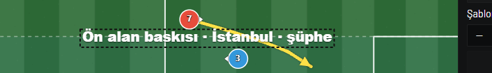

### tr-display-mixed

- **Sample:** `Müller · 天皇杯 · Łódź · İstanbul`
- **Font preset:** display
- **Glyph audit:** pass
- **Screenshot:** 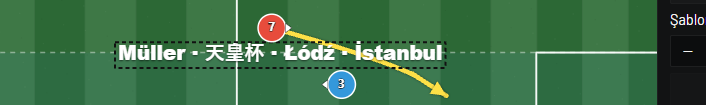

### it-system-locale

- **Sample:** `Pressing alto · Passaggio · corsa`
- **Font preset:** system
- **Glyph audit:** pass
- **Screenshot:** 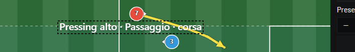

### it-system-mixed

- **Sample:** `Müller · 天皇杯 · Łódź · İstanbul`
- **Font preset:** system
- **Glyph audit:** pass
- **Screenshot:** 

### it-display-locale

- **Sample:** `Pressing alto · Passaggio · corsa`
- **Font preset:** display
- **Glyph audit:** pass
- **Screenshot:** 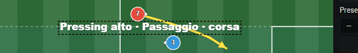

### it-display-mixed

- **Sample:** `Müller · 天皇杯 · Łódź · İstanbul`
- **Font preset:** display
- **Glyph audit:** pass
- **Screenshot:** 
